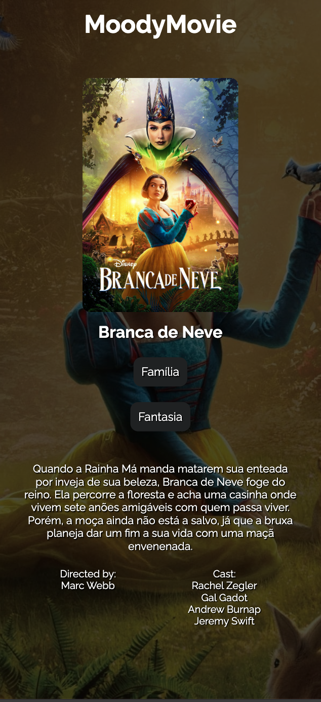

# MoodyMovie
## Table of contents
  - [The Website](#The-Website)
  - [Screenshots](#screenshots)
  - [Functionalities](#Functionalities)
  - [Process Highlights](#Process-Highlights)
  - [Built with](#built-with)
  - [Link](#Link)
  - [Author](#author)
  
### The Website
A responsive website that recommends movies to the user based on their mood.

### Screenshots

### Functionalities
 The user can select their mood from a dropdown menu, automatically generating a list of movies from different genres that match the chosen emotional state. Each movie is displayed in an interactive card, and clicking on it takes the user to a page with detailed information about the title. Additionally, the site offers the option to switch between Portuguese and English, ensuring a personalized and accessible experience.

### Tools
The website was primarily built using React.js, providing a more dynamic and fluid experience. Movie information was retrieved via Axios from the TMDB APIs. For navigation, the React Router DOM library was used, ensuring smooth transitions between pages, including detailed movie views. Most of the styling was implemented using Styled Components, making the code structure more organized and facilitating future maintenance. Additionally, the Context API was implemented to manage language switching between Portuguese and English, allowing users to choose the option that best suits their preferences.

### Process Highlights
As a film graduate, I wanted to create a project that combined two of my greatest passions: audiovisual storytelling and programming. Developing this application was an exciting challenge. The TMDB APIs provide a vast amount of information, so during the planning phase, it was crucial to explore them thoroughly to filter and map only the necessary data. Additionally, I researched references to design an intuitive layout and studied the Styled Components library to bring my vision to life.

The most complex part of the project was developing a mechanism capable of translating the user's mood into varied and relevant movie recommendations. My goal was to ensure that the generated list was diverse, considering that people's movie preferences can change based on their emotional state. In this regard, the wide range of genres covered by TMDB was extremely helpful in creating more personalized and dynamic recommendations.

Ultimately, this project was not just a technical exercise but also a way to express my love for cinema and technology, crafting an interactive experience that connects viewers to movies in an innovative way.

### Built with
- HTML 5
- CSS 3
- React JS
- JSON
- API
- Git/GitHub

### Link
https://moody-movie-iumfzjvpq-rafaels-projects-3b81a1b9.vercel.app

### Author
Rafael Gevú

# MoodyMovie

## Tabela de Conteúdos
 - [O Site](#O-site)
 - [Capturas de Tela](#Capturas-de-tela)
 - [Funcionalidades](#functionalidades)
 - [Destaques do Processo](#Destaques-do-processo)

 - [Desenvolvido com](#Desenvolvido-com)
 - [Link](#Link)
 - [Autor](#Link)

### O Site
Um site responsivo que recomenda filmes para o usuário com base no seu humor.

### Capturas de tela

### Funcionalidades
O usuário pode selecionar seu humor através de um menu suspenso, gerando automaticamente uma lista de filmes de diferentes gêneros que correspondem ao estado emocional escolhido. Cada filme é exibido em um card interativo, e ao clicar nele, o usuário é direcionado para uma página com informações detalhadas sobre o título. Além disso, o site oferece a opção de alternar o idioma entre português e inglês, garantindo uma experiência personalizada e acessível.

### Ferramentas
O site foi desenvolvido principalmente com React.js, proporcionando uma experiência mais dinâmica e fluida. As informações dos filmes foram obtidas via Axios a partir das APIs do TMDB. Para a navegação, a biblioteca React Router DOM foi utilizada, garantindo transições suaves entre as páginas, incluindo a visualização detalhada de cada filme. A estilização foi feita, em grande parte, com Styled Components, tornando o código mais organizado e facilitando futuras manutenções. Além disso, a Context API foi implementada para gerenciar a alternância entre os idiomas português e inglês, permitindo que o usuário escolha o que melhor se adapta às suas preferências

### Destaques do Processo

Como sou formado em cinema, quis criar um projeto que unisse duas grandes paixões minhas: o audiovisual e a programação. Desenvolver essa aplicação foi um desafio empolgante. As APIs do TMDB oferecem uma enorme variedade de informações, então, durante a fase de planejamento, foi essencial explorá-las a fundo para filtrar e mapear apenas os dados realmente necessários. Além disso, pesquisei referências para criar um layout intuitivo e estudei a biblioteca Styled Components para transformar minha visão em realidade.

A maior complexidade do projeto foi desenvolver um mecanismo capaz de traduzir o humor do usuário em sugestões de filmes variadas e relevantes. Meu objetivo era que a lista gerada fosse diversa, considerando que as preferências cinematográficas podem mudar de acordo com o estado emocional de cada pessoa. Nesse sentido, a abrangência dos gêneros oferecidos pelo TMDB foi uma grande aliada, permitindo criar recomendações mais personalizadas e dinâmicas.

No final, esse projeto não foi apenas um exercício técnico, mas também uma forma de expressar meu amor pelo cinema e pela tecnologia, criando uma experiência interativa que conecta os espectadores aos filmes de uma maneira inovadora.

### Desenvolvido com

- HTML 5
- CSS 3
- React JS
- JSON
- API
- Git/GitHub

### Link
https://moody-movie-iumfzjvpq-rafaels-projects-3b81a1b9.vercel.app

### Autor
Rafael Gevu